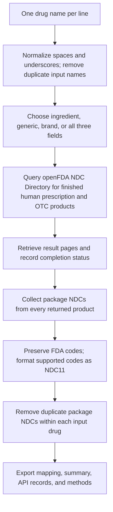

# Drug name to NDC

A browser-based lookup tool for ingredient, generic, and brand names. It retrieves package NDCs from openFDA and exports an Excel workbook.

## Publish on GitHub Pages

1. Sign in to GitHub and [create a repository](https://github.com/new). A suggested name is `ndc-lookup`. Choose **Public**. Adding an initial README is optional; this package includes one.
2. Extract `ndc-lookup-github-pages.zip` on your computer.
3. In the repository, choose **Add file → Upload files**. If the repository is empty, use **uploading an existing file** on its initial page.
4. Upload the extracted files themselves into the repository's top level. Do not upload the ZIP or its enclosing folder. You should see `index.html`, `styles.css`, `app.js`, `engine.js`, `export.js`, `README.md`, and `.nojekyll` at the top level. The `.nojekyll` file tells Pages to publish the files without Jekyll processing.
5. Save the upload to the `main` branch using **Commit changes**. If your account requires a pull request, merge it into `main` before the next step.
6. Open **Settings → Pages**. Under **Build and deployment**, set **Source** to **Deploy from a branch**. Select **main** and **/(root)**, then select **Save**.
7. Wait for deployment to finish. Check the **Actions** tab if you need its status. Return to **Settings → Pages** and open the published website link shown there.
8. In the published site, select **Load 3 examples**, then **Find NDCs**. Once the batch completes, select **Export Excel** and confirm the workbook downloads. Share the published website link with colleagues.

The expected address pattern is `https://YOUR-USERNAME.github.io/ndc-lookup/` if you use the suggested repository name. This is an example pattern, not a currently published URL. Use the exact address GitHub displays after successful deployment.

GitHub Pages supports public repositories on GitHub Free. The website uses relative asset paths and HTTPS requests to openFDA, so it can run under a GitHub Pages project address. Visitors use the public website; they do not need to install Node.js or download this repository.

If your organization blocks the published domain, request approval from its IT team. If the page opens but lookups fail, check access to `https://api.fda.gov` as well as the error shown in the app. The local address `127.0.0.1:4174` is not the published address.

## How to use the tool

1. Choose **Any drug name**, **Generic name**, **Ingredient name**, or **Brand name**.
2. Enter one drug name per line. Keep the words of a multiword name on the same line. Spaces and underscores are accepted within a name; for example, `bupropion hydrochloride` and `bupropion_hydrochloride` are treated as the same search.
3. Select **Find NDCs** and wait for completion.
4. Select **Export Excel** to download the workbook.

The three optional examples can be replaced with your own list. There are no fixed CYP or AED lists in this tool. The maximum batch size is 200 unique input names.

## Mapping workflow

The search uses quoted names in the selected FDA fields: `active_ingredients.name`, `generic_name`, and/or `brand_name`. **Any drug name** combines these fields with OR. It also requires `finished:true` and a product type of `HUMAN PRESCRIPTION DRUG` or `HUMAN OTC DRUG`.

The app keeps all API-returned products, including combinations, salt forms, and brand variants. It does not perform an additional ingredient-equivalence check or a manual review step. Package codes come from `packaging.package_ndc`. Supported segmented formats are converted to 11 digits; unsupported or ambiguous formats retain their original code with a blank NDC11. Codes are exported as text to preserve leading zeros.

## Workbook tabs

| Tab | Contents |
| --- | --- |
| NDC mapping | One row per input drug and package NDC, including the FDA code, NDC11, generic name, and brand name. |
| Drug summary | Product and NDC counts, completion status, notes, and timestamps. |
| API records | Detailed returned product/package fields and source URLs, including products without package codes. |
| Methods and workflow | Search scope, formatting logic, source documentation, and batch information. |

## Scope and limitations

- This is a lookup of the currently available openFDA NDC Directory. It does not reconstruct historical NDC coverage for 2015–2026.
- API search results are not a clinically adjudicated ingredient-equivalence list. Combinations and name variants may be returned.
- No returned results means no products were found by that query within the chosen scope; it does not establish that the drug has never had an NDC.
- Interrupted or failed requests are marked as partial. A partial export is not a completed search.
- NDC assignment and directory inclusion do not establish FDA approval.
- Drug-name queries are sent directly to openFDA. The application holds returned results in the browser and generates the workbook there.

## Files and updates

The five application files are `index.html`, `styles.css`, `app.js`, `engine.js`, and `export.js`. There is no installation or build step for GitHub Pages. To update the website, replace these files in the configured publishing branch; GitHub Pages deploys changes from that branch.

## Documentation

- [GitHub Pages publishing settings](https://docs.github.com/en/pages/getting-started-with-github-pages/configuring-a-publishing-source-for-your-github-pages-site)
- [Upload files to a GitHub repository](https://docs.github.com/en/repositories/working-with-files/managing-files/adding-a-file-to-a-repository)
- [About GitHub Pages](https://docs.github.com/en/pages/getting-started-with-github-pages/what-is-github-pages)
- [openFDA NDC searchable fields](https://open.fda.gov/apis/drug/ndc/searchable-fields/)
- [openFDA query parameters](https://open.fda.gov/apis/query-parameters/)
- [FDA NDC Directory](https://www.fda.gov/drugs/drug-approvals-and-databases/national-drug-code-directory)
